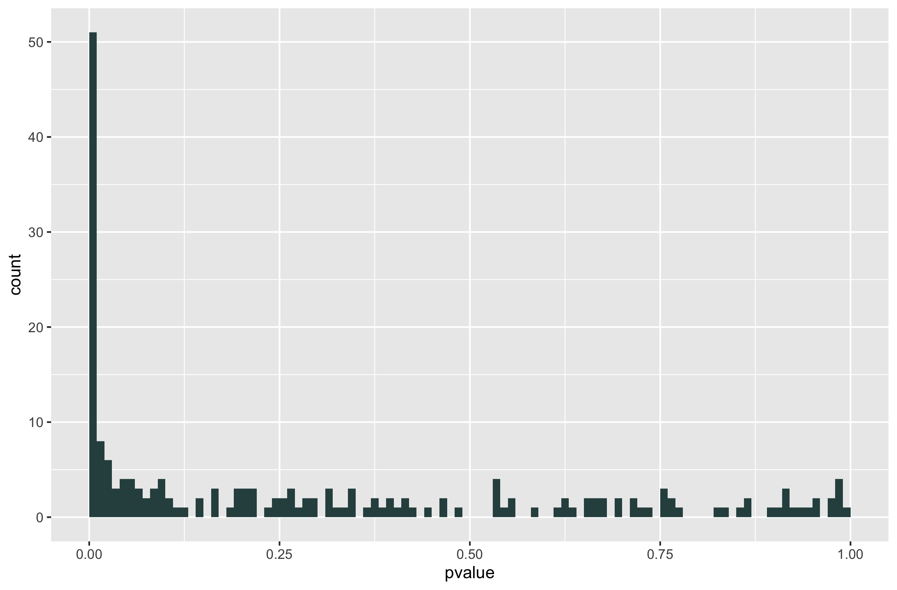
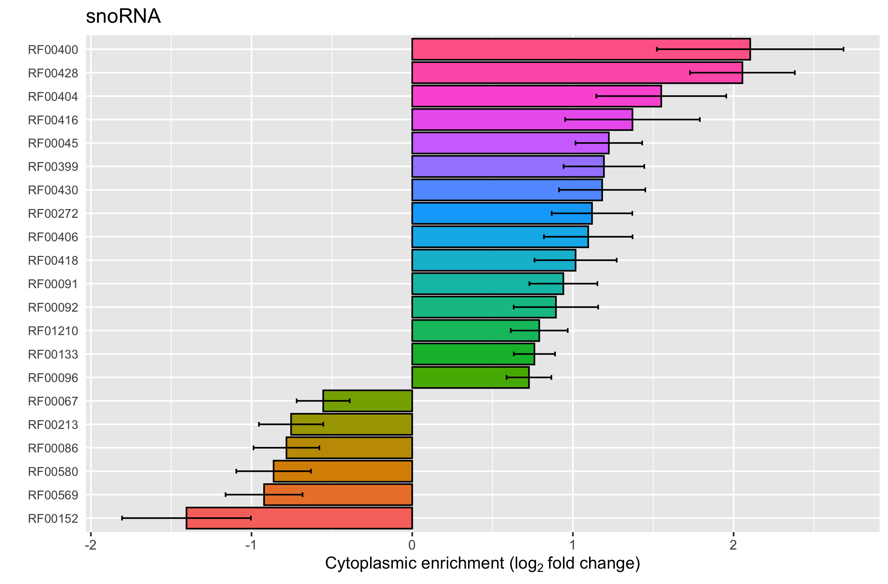

# s3RNA: Subcellular swine small RNA data

This is a dataset of miRNA and snoRNA reads from swine granulosa cells used in Pan, Toms, et al. (2020).

## Installation
s3RNA is a dataset package for the R statisical computing language, and was built and tested on versions >= 3.5, and certain dependencies did not work during testing on 3.3. To install s3RNA, type either of these commands into the console:

``` r
devtools::install_github("derektoms/s3RNA")
```

...or...

``` r
source("https://install-github.me/derektoms/s3RNA")
```

No packages imported by s3RNA, although we suggest rnaseqGene and DESeq2 for analysis and visualization.

## Example usage

Loading this library will make two count tables available for analysis, ```miRReads``` and ```snoRReads```. Each is a list of two data frames containing unprocessed read counts (```raw.count```) and column data (```col.dat```). Analysis has been performed using the DESeq2 package, although additional approaches are possible. An example use would be to define an analysis model, compute significant differences, check the distribution of p-values, and plot expression sorted by fold change. This is shown below:
```r
library(s3RNA)
library(ggplot)

sno <- DESeqDataSetFromMatrix(countData = snoRReads$raw.count, colData = snoRReads$col.dat, design=~size*subcell+batch)

## Full linear model, two factors
sno.d <- DESeq(sno)

size <- results(sno.d, contrast=c("size","small","large"))
local <- results(sno.d, contrast=c("subcell","cytosol","nucleus"))

## Check distribution of p-values
ggplot(as(local, "data.frame"), aes(x = pvalue)) + geom_histogram(binwidth = 0.01, fill = "darkslategray", boundary = 0)
```

```r
## Now plot the expression of those snoRNA with significant differences
sno.loc <- local[which(local$padj<0.01),]
locTopTable<-sno.loc[order(sno.loc$log2FoldChange,decreasing=TRUE),]
df <- data.frame(sno=rownames(locTopTable),lfc=locTopTable$log2FoldChange,se=locTopTable$lfcSE)
p <- ggplot(df,aes(x=reorder(sno,lfc, sum),y=lfc))+ geom_col(aes(fill=reorder(sno,lfc, sum)),colour="black") + geom_errorbar(aes(ymin=lfc-se,ymax=lfc+se),width=0.2)
p <- p + coord_flip() + labs(title="snoRNA", x="", y=expression("Cytoplasmic enrichment ("*log["2"]~"fold change)")) + theme(axis.text.y = element_text(size=8,hjust=0), axis.ticks.y = element_blank(), legend.position="none")
p
```


# License
This package is free software; you can redistribute it and/or modify it under the terms of the GNU General Public License, version 3, as published by the Free Software Foundation.

This program is distributed in the hope that it will be useful, but without any warranty; without even the implied warranty of merchantability or fitness for a particular purpose. See the GNU General Public License for more details.

A copy of the GNU General Public License, version 3, is available at https://www.r-project.org/Licenses/GPL-3

